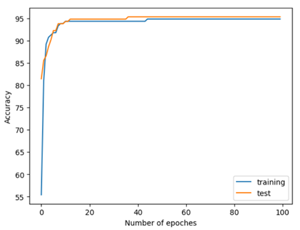
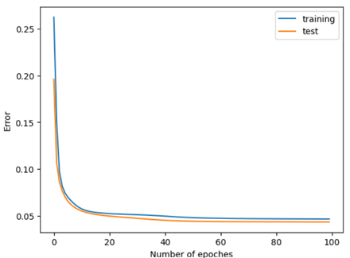

# Neural Network from Scratch

## Description
This repository provides an implementation of a fully connected neural network, offering flexible customization of network architecture, allowing easy adjustment of layer sizes and hidden layers. As the creator of this repository, I've developed two projects that utilize this neural network for classification tasks. Continue reading for further information.

## Table of Contents
- [Repository Contents](#repository-contents)
- [Technologies Used](#technologies-used)
- [Project 1: Chronic Kidney Disease Classification](#project-1-chronic-kidney-disease-classification)
  - Overview
  - Dataset Description
  - Data Preprocessing
  - Model Architecture and Training
  - Results
- [Project 2: Oscillators Classification in Game of Life](#project-2-oscillators-classification-in-game-of-life)
  - Overview
  - Dataset Description
  - Data Preprocessing
  - Model Architecture and Training
  - Results

## Repository Contents
1. [neural_network](https://github.com/cayscays/neural-network-from-scratch/tree/main/neural_network): The implementation on the neural network.
2. [chronic_kidney_disease_classification](https://github.com/cayscays/neural-network-from-scratch/tree/main/chronic_kidney_disease_classification) : This project focuses on classifying Chronic Kidney Disease in individuals using my neural network.
3. [oscillators_classification_in_game_of_life](https://github.com/cayscays/neural-network-from-scratch/tree/main/oscillators_classification_in_game_of_life): This project focuses on classifying oscillators within a cellular automaton using my neural network.

## Technologies Used
- Python 3.10, Jupyter Notebook, Numpy 1.22.1, Pandas, Matplotlib, and Weka.

---

## Project 1: Chronic Kidney Disease Classification
### Overview:
This project focuses on classifying Chronic Kidney Disease (CKD) in individuals. The classification result will be true for CKD cases and false for non-CKD cases.

### Dataset Description:
Chronic Kidney Disease dataset by L. Rubini, P. Soundarapandian, and P. Eswaran, donated on 7/2/2015. Retrieved from https://archive.ics.uci.edu/dataset/336/chronic+kidney+disease. Licensed under CC BY 4.0. 

### Data Preprocessing:

- **Anomaly Detection and Removal**: Less than 3% of the dataset contained entries with irregular values, which were deemed unsuitable for analysis and were subsequently removed to ensure data integrity.
  
- **Handling Missing Values**: Over 30% of the dataset had missing values. I used Weka to visualize the data, where linear relationships between attributes were observed. Due to its significant missing values (32.13%), the attribute "rbcc" was removed, as it displayed an almost linear relationship with "hemo" and "pcv". Similarly, the attributes "pcv" (17.22% missing) and "hemo" (12.85% missing) also showed an almost linear relationship, therefore I removed "pcv" as well. Please refer to the accompanying graphs for a visual representation

    

- **Missing Values Replacement**: The missing values in the dataset were replaced using the "ReplaceMissingValues" filter in Weka to ensure comprehensive data utilization while mitigating the impact of missing entries.

- **Data Discretization**: Weka's functionality was utilized for data discretization, which involved grouping continuous attribute values into intervals to facilitate analysis and interpretation.

The final stage of data preprocessing involved preparing the dataset for input into my neural network. Given the requirement for values within the range of [0,1] in the input layer of the neural network, the following transformations were applied:

- **Binary Features**: Values corresponding to binary features were transformed to 0 or 1:
  - Changed "notckd", "normal", "no", "notpresent", "good" to 0.
  - Changed "ckd", "yes", "abnormal", "present", "poor" to 1.

- **Continuous Features**: For features with numerical ranges (after discretization), the first number of each range was extracted and scaled to the range of 0 to 1 using the formula 1/original_value.

This normalization process was implemented using Python. You can find the code for this preprocessing step [here](link_to_code).

### Model Architecture and Training:
The model architecture is a fully connected neural network trained using backpropagation. It includes the following attributes:
- Input layer: 22 neurons representing the attributes of the input data.
- Hidden layers: One layer, containing 5 neurons.
- Output layer: One neuron. 
- Learning rate: 0.5.
- Random seed: 90.
- Epochs: 100.
- Activation function: Sigmoid.

### Results:

- **Test Accuracy**: After training the neural network, a test accuracy of 95.36% was achieved. This high accuracy demonstrates the effectiveness of even a small neural network in classifying CKD cases.

- **Sensitivity (True Positive Rate)**: The sensitivity of 0.9205 suggests that the model correctly identifies approximately 92.05% of individuals with CKD out of all individuals who actually have CKD. The most critical aspect of sensitivity for this classification task is its ability to ensure that individuals with CKD are correctly identified, thereby preventing missed diagnoses and enabling timely treatment. Therefore this value indicates room for improvement.

- **Overfitting**: No overfitting was observed in the training process. Please refer to the accompanying graphs for a visual representation of the training and test performance.

---
## Project 2: Oscillators Classification in Game of Life
### Overview:
The project aims to classify oscillators within Conway's Game of Life. 

### Dataset Description:
[The dataset](https://github.com/cayscays/oscillators-7x7-dataset-game-of-life/) contains a list of 7x7 oscillators in Conway's Game of Life. The oscillators in the dataset have a maximum period of 15 generations, with the grid borders extending to infinity.

### Data Preprocessing:
Given the inherently clean nature of the dataset, minimal preprocessing was required before training the classification model. I used utility functions from my [dataset repository](https://github.com/cayscays/oscillators-7x7-dataset-game-of-life/tree/main/data_management) to enrich the dataset by incorporating non-oscillators and diversifying entries through grid state flipping. Each entry was then flattened and transformed into a list, aligning with the network's input requirements for further analysis and modelling.

### Model Architecture and Training:
The model architecture is a fully connected neural network trained using backpropagation. It includes the following attributes:
- Input layer: 49 neurons representing the cell states of the input data.
- Hidden layers: Two layers, each containing 7 neurons.
- Output layer: One neuron. The threshold for classifying oscillators and non-oscillators is set at 0.5. Above it, the pattern is an oscillator.
- Learning rate: 0.5.
- Random seed: 10.
- Epochs: 20.
- Activation function: Sigmoid.

### Results:
- **Test Accuracy**: After running the neural network for 20 epochs, a test accuracy of 97.26% was achieved. This indicates the model's effectiveness in classifying 7x7 oscillators within Conway's Game of Life. The high accuracy attained demonstrates the capability of even a small neural network to learn and generalize patterns.

- **Overfitting**: No overfitting was observed in the training process. Please refer to the accompanying graphs for a visual representation of the training and test performance.

---
Thank you for reviewing my neural network and classification projects!

Created by [cayscays](https://github.com/cayscays/).
